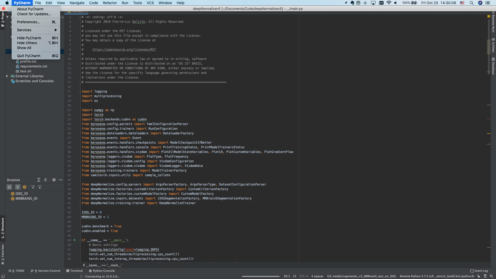
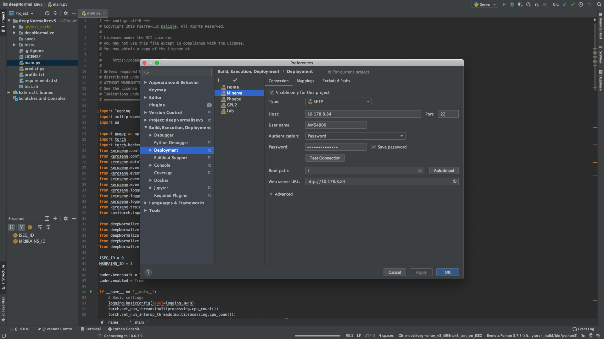
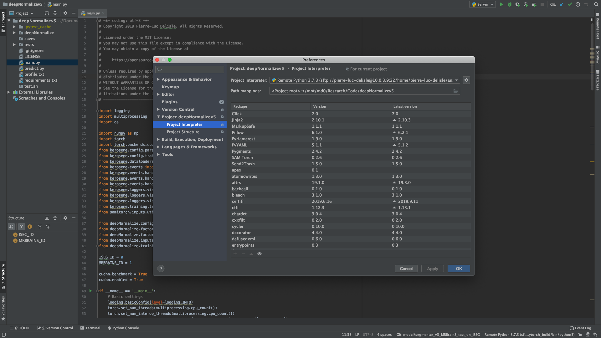
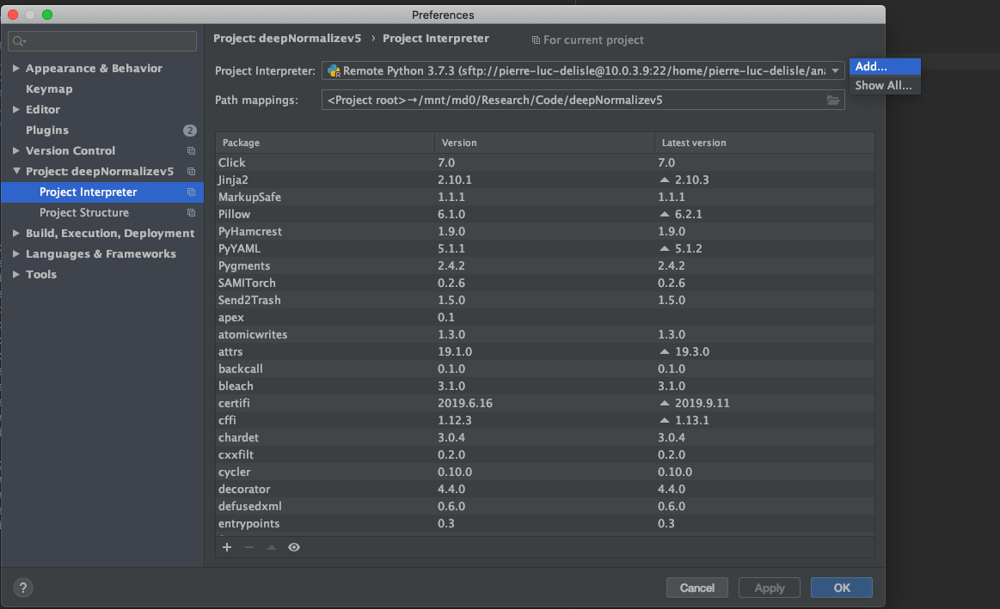
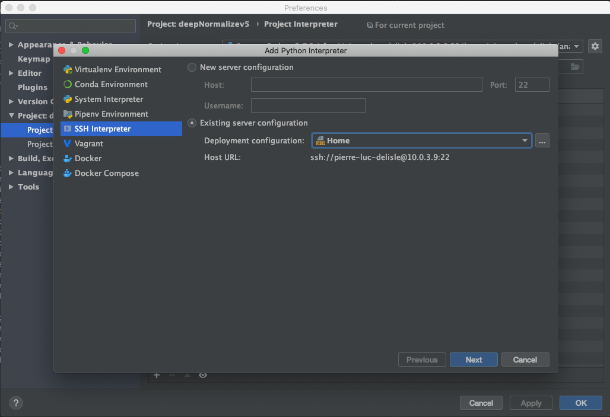
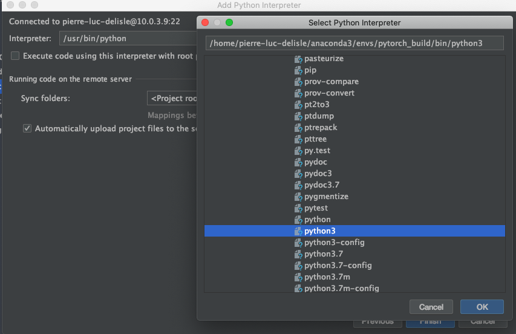
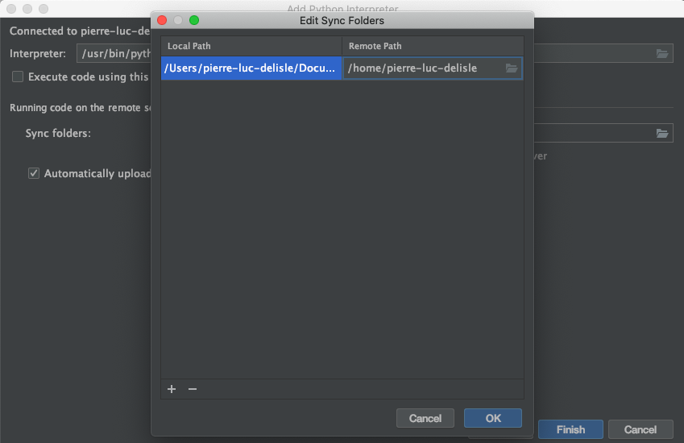
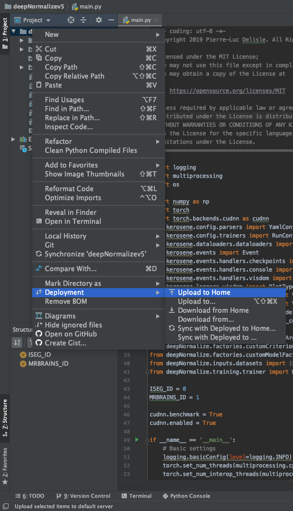

# JetBrains IDEs

JetBrains IDEs are the most useful software you'll ever need in the lab, especially JetBrains PyCharm. It's certainly
one of the most powerful IDE for Python language ever made.

## License

JetBrains IDE are not free. But, if you're a student or an instructor (teaching staff members) all IDEs from JetBrains 
are free to use. You have to subscribe as student on the [student section](https://www.jetbrains.com/student/) of 
JetBrains' website. It can take a couple of days before being granted to use the Professional Edition for free. Your
student status must be renewed every year.

## Installation

Simply go to the [PyCharm website](https://www.jetbrains.com/pycharm/) and download the Professional Edition. Log in 
with your JetBrains account to register your copy.

## Running remote code

Follow the instructions to configure your workstation to run your code remotely on any ETS server or workstation.

### Configuring Deployment options

One of the most useful feature in the Professional Edition is the ability to run code remotely on ETS' GPU servers.

To do so, you have to configure the `Deployment` options. 

First, select PyCharms Menu -> Preferences.

Then, go to `Build, execution, deployment` section and then `Deployment`. 

Click the  button to add a configuration, and enter the IP address, username and password given
by ETS' chief IT engineer to connect to the server. It can also be your personal workstation in the Lab. 

Then, go to the `Mappings` tab and select the desired source and destination paths. The source is likely be your local
project path, while the destination path should be either in `/data/users/<YOUR USER>` if available or your personal
`/home/<YOUR USER>` home folder.

### Configuring remote SSH interpreter

To run your Python code remotely on a server, an SSH Python interpreter must be configured. Still in the PyCharm Menu -> 
Preferences, select the `Project: <YOUR PROJECT>` section.

Click the  icon to add an interpreter.

Select the `SSH Interpreter` on the left, and select the previously created Deployment configuration.

Get the path of the UNIX Python binary executable file. This is likely to be a Conda environment under 
`/home/<YOUR USER>/anaconda3/envs/<YOUR ENV>/bin/python3` or a `virtualenv` virtual environment 
`/home/<YOUR USER>/path/to/your/virtualenv`.

Next to `Sync folders`, select the proper destination folder. It should be your project's deployment path.

Click on `Finish` and you are ready to upload your code. Select your root project folder, right click, and under `Deployment`
section, select `Upload to <DEPLOYMENT NAME>`.

Your code will be uploaded to the remote server. With the configured Python interpreter, you will be able to 
either run or debug the code remotely.

